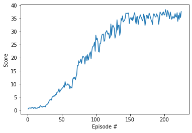

# Training to control a robotic arm with DDPG algorithm

## Environment
Unity Machine Learning Agents ([ML-Agents](https://github.com/Unity-Technologies/ml-agents)) is an open-source Unity plugin that enables games and simulations to serve as environments for training intelligent agents. 

This repo presents code and step by step guide on how to train an intelligent agent to solve the [Reacher environment](https://github.com/Unity-Technologies/ml-agents/blob/master/docs/Learning-Environment-Examples.md#reacher).

In this slightly modified Reacher environment, an ensemble of 20 double-jointed arms can move to target locations. A reward of +0.1 is provided for each step that the agent's hand is in the goal location. Thus, the goal of your agent is to maintain its position at the target location for as many time steps as possible.

The observation space consists of 33 variables corresponding to position, rotation, velocity, and angular velocities of the arm. Each action is a vector with four numbers, corresponding to torque applicable to two joints. Every entry in the action vector should be a number between -1 and 1.

## Goal
The goal is to train agents to get an average score of at least +30 (over 100 consecutive episodes, and over all agents). Specifically,
* After each episode, we add up the rewards that each agent received (without discounting), to get a score for each agent. This yields 20 (potentially different) scores. We then take the average of these 20 scores.  

* This yields an average score for each episode (where the average is over all 20 agents).

As an example, consider the plot below, where we have plotted the average score (over all 20 agents) obtained with each episode.  

  
The environment is considered solved, when the average (over 100 episodes) of those average scores is at least +30.

## Result
A movie clip demonstrating successfully trained agents (achieving an average score of +35) is shown below. The robotic arms follow the targets (rotating green ball) most of the time.  

  

## Dependencies
* Numpy
* matplotlib
* PyTorch (0.4.0 or above)
* ML-Agents toolkit (unityagents)

## Usage
* The Windows (64-bit) version of the environment is provided in this repo.
* Mac OSX version can be downloaded [here](https://s3-us-west-1.amazonaws.com/udacity-drlnd/P2/Reacher/Reacher.app.zip)
* Linux version can be downloaded [here](https://s3-us-west-1.amazonaws.com/udacity-drlnd/P2/Reacher/Reacher_Linux.zip)

Follow the step by step instructions in **Report.ipynb** to start running the environment and train the agents.
